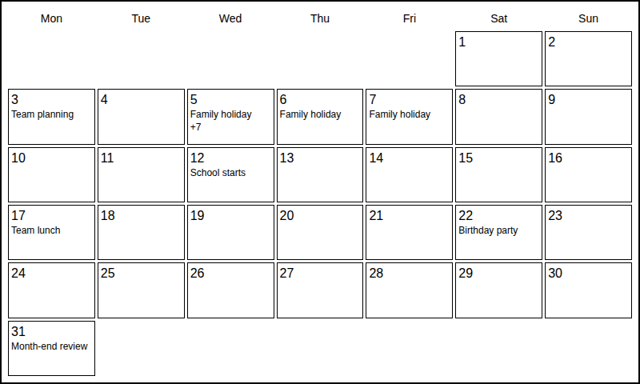

# IDL Calendar

A dependency-free, read-only Home Assistant dashboard card, installable through
HACS. It is only a display UI for native Home Assistant `calendar.*` entities,
not a calendar provider or event store. It shows only a static whole-month grid:
weekday headings, day numbers, and event names. There are no buttons, date
selection, navigation, agenda, or event-editing controls. All options are set
through the card configuration.



Preview uses fictional events for August 2026, including a busy day with `+7`
hidden events. It is captured from the actual card in TRMNL mode.

## Installation

1. Set up at least one calendar integration in Home Assistant.
2. In HACS, open **Custom repositories**, add
   `https://github.com/ramiroidl/idl-calendar`, and select **Dashboard**
   (called **Lovelace** or **Plugin** in older HACS versions).
3. Download **IDL Calendar**. If HACS does not register the resource automatically,
   add `/hacsfiles/idl-calendar/idl-calendar.js` as a **JavaScript module** in
   **Settings → Dashboards → Resources** (enable advanced mode if needed).
4. Add a manual card to a dashboard:

```yaml
type: custom:idl-calendar
entities:
  - calendar.family
  - calendar.work
display_mode: trmnl
max_events: 8
```

For manual installation, copy `idl-calendar.js` into `/config/www/` and register
`/local/idl-calendar.js` as a JavaScript module instead.

## Options

| Option | Default | Description |
| --- | --- | --- |
| `entities` | Required | Non-empty list of Home Assistant calendar entity IDs. |
| `month` | Current month | Optional fixed month as a quoted `YYYY-MM` string, e.g. `"2026-08"`. Omit to follow the current month automatically. |
| `week_start` | `1` | First weekday: `1` for Monday or `0` for Sunday. |
| `max_events` | `8` | Maximum event names per cell; integer from 1 to 50. Available space may lower this limit. |
| `refresh_interval` | `300` | Refresh interval in seconds; integer from 60 to 86400. |
| `display_mode` | `responsive` | `responsive` for dashboards, `trmnl` for a fixed 800×480 canvas. |
| `height` | `480` | Responsive grid height in pixels; integer from 360 to 2160. TRMNL mode always uses 480. |

## Static calendar display

Every date is shown, including months spanning six calendar rows. Weekday names
appear across the top; each non-interactive date cell contains its day number
and a list of event names. There is no visible title, month toolbar, or secondary
event panel. The month/year remains available as an accessible label.
No hours, “All day”/“Ongoing” labels, or calendar names are displayed.
The current day number is bold and underlined.

Multi-day and overnight events appear on every day they overlap; an event ending
at midnight does not appear on the following day. Events retain chronological
ordering. Each name occupies one line; long names are ellipsized rather than
wrapping. The card measures the available cell height and shows as many names as
fit, up to `max_events`. If events remain, it reserves the last line for `+n`,
where `n` is the number of hidden events. Layout resizing recalculates capacity.
Accessible date labels include all names, including those omitted visually.

The entire configured month is read through Home Assistant's authenticated
calendar endpoint. All-day dates retain their calendar date; timed events and
the query window use the browser's local timezone. Set the rendering browser's
timezone to the intended display timezone. With `month` omitted, refresh follows
the current month at month boundaries. A configured month remains fixed.
Missing calendars do not hide events from available calendars and are retried
on refresh. Loading, empty, and error statuses are available to assistive
technology without adding visual panels to the calendar.

**Configuration migration:** `title`, `view`, and `days` from earlier versions
no longer affect the display. Agenda and selected-day views have been removed;
the card always renders the month grid. Set `month` to change the displayed
period and `height`/`max_events` to control density.

## Low-resolution displays / TRMNL OG

Use `display_mode: trmnl` on a dedicated dashboard for the TRMNL OG's 800×480
landscape resolution. The card uses solid black text and rules on white,
high-contrast typography, and no interactive controls. The month grid occupies
the entire canvas and automatically fits four, five, or six calendar rows.
Responsive mode scales the same seven-column grid to the dashboard width,
using the configured height. Hidden events are represented by `+n`, not a
touch action or another view.

**This is a Home Assistant frontend card, not a native TRMNL plugin or a device
transport.** A TRMNL OG cannot execute a Lovelace JavaScript card directly.
To use it on the device, an external workflow must render the authenticated
dashboard in a browser, capture the card at 800×480, and send the image using your
TRMNL-supported image delivery setup. That capture/push workflow is not included.
Allow the card to finish loading before capturing. Keep Home Assistant private;
do not publish dashboards or embed access tokens in URLs or card configuration.

The card uses Home Assistant's existing authenticated `hass.callApi` connection
and only reads the calendar events endpoint. It does not store credentials.
Read-only here describes the card's behavior, not a restriction on the underlying
Home Assistant user's permissions.

## Development

No build step or runtime packages are needed; HACS serves the root JavaScript
module directly. With Node.js 22 or later, run the focused tests using `npm test`.
The tests use Node's built-in test runner; no package installation is required.